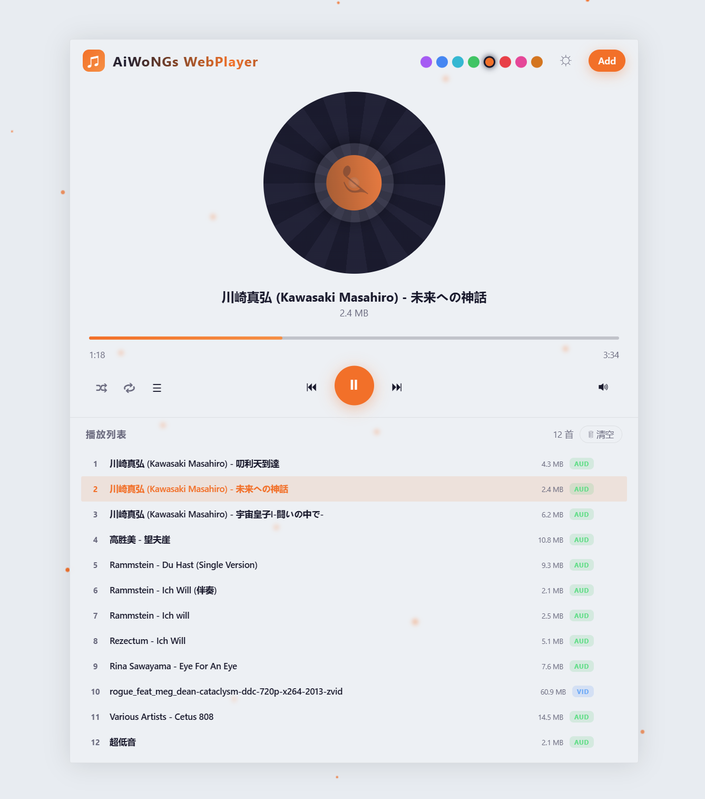
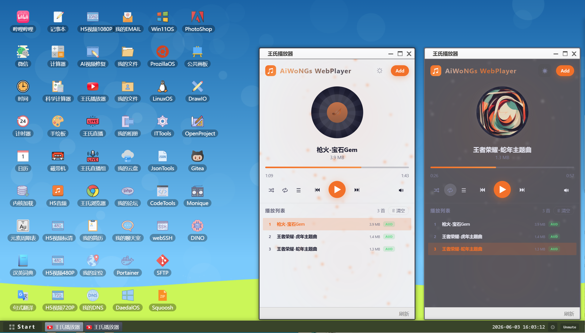

# 💿 AiWoNGs WebPlayer · 王氏WEB播放器

> **极简而不简单。** 一个基于原生 JavaScript 构建的纯前端、零依赖多媒体中心。

[](https://www.gnu.org/licenses/agpl-3.0.html)
[](javascript:void(0))
[](javascript:void(0))

---



## ✨ 核心特性

### 🎨 视觉与交互 (Visuals)
- **动力学黑胶唱盘**：基于 `requestAnimationFrame` 驱动的同步旋转动效，支持优雅的缓停过渡。
- **灵动粒子背景**：Canvas 实时渲染低调浮动粒子，色彩随主题自动适配。
- **全屏拖拽感知**：进入拖拽区域时，全屏呈现逆时针滚动虚线边框，仪式感拉满。
- **上帝之眼 (The Eye)**：隐藏在品牌名背后的交互彩蛋，眨眼间彰显版权深度。

### ⚙️ 技术内核 (Core)
- **ID3v2 深度解析**：直接从二进制流中提取内嵌封面与元数据，离线也能看到封面。
- **智能跨流平滑**：250ms 交叉淡入淡出（Crossfade），告别切歌时的突兀断感。
- **全格式兼容**：支持 MP3 / FLAC / WAV / MP4 / MKV 等，编码不支持时自动优雅降级为音频模式。
- **零负担架构**：纯 HTML/CSS/JS 编写，无需构建工具，双击即用。

---

## 🛠 快捷键指南

| 按键 | 功能描述 |
| :--- | :--- |
| **Space** | 播放 / 暂停 (Play / Pause) |
| **← / →** | 步进 / 步退 5s (Seek Forward/Back) |
| **↑ / ↓** | 精度音量调节 (Volume Control) |
| **N / P** | 切歌 (Next / Previous) |
| **S / R** | 随机播放 / 循环模式切换 (Shuffle / Repeat) |
| **M / F** | 静音 / 全屏切换 (Mute / Fullscreen) |

---

## 🚀 快速开始

无需编译，无需部署。

1. 下载或克隆本仓库。
2. 使用现代浏览器直接打开 `index.html`。
3. **拖入** 你的文件夹，开始享受纯粹的律动。

```bash
# 仅仅只需要这个文件
index.html
```

---

## 🧪 技术栈

> 坚持“原生至上”的开发哲学，压榨浏览器原生 API 的每一分潜力。

- **渲染层**: HTML5 Canvas (Particles), CSS Grid & Flexbox (Responsive Layout)
- **处理层**: FileReader API, Blob URL, DataTransfer API (Folder Recursion)
- **音频层**: Web Audio API (Crossfading), Vanilla JS Business Logic
- **协议层**: 自研 ID3v2 标签解析算法

---

## 📜 开源协议

**Copyright © 2026 AiWoNGs SOFTWARE.**

本项目采用 [AGPL 3.0 License](https://www.gnu.org/licenses/agpl-3.0.html) 协议开源。

> [!IMPORTANT]
> 这是一个完全本地化的播放器，我们不上传你的任何数据。你的音乐，只属于你的浏览器。
